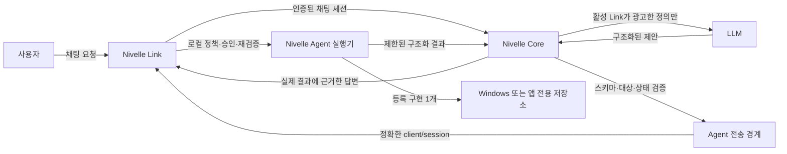

# Nivelle Agent 도구 아키텍처

## 목적과 현재 범위

Nivelle Agent는 Nivelle Link가 실행되는 Windows PC에서 제한된 로컬 작업만 수행하는
클라이언트 측 실행 경계다. 모델은 작업을 제안할 수 있지만 실행 권한을 갖지 않는다.
Nivelle Core의 검증도 Link의 로컬 정책과 사용자의 결정을 우회할 수 없다.

Phase 3의 닫힌 도구 집합은 다음 8개뿐이다.

| 도구 | 위험 등급 | 기본 승인 | 부작용/재실행 정책 |
| --- | --- | --- | --- |
| `get_system_status` | `SAFE_STATUS` | 불필요 | 읽기 전용 |
| `get_active_window` | `LOCAL_READ` | 한 번 허용 | 읽기 전용 |
| `open_application` | `INTERACTIVE` | 한 번 허용 | at-most-once, 정확한 대상 영구 승인 가능 |
| `open_folder` | `INTERACTIVE` | 한 번 허용 | at-most-once, 정확한 대상 영구 승인 가능 |
| `search_files` | `LOCAL_READ` | 한 번 허용 | 읽기 전용, 취소 가능 |
| `read_text_file` | `LOCAL_READ` | 한 번 허용 | 읽기 전용, 결과 제한 적용 |
| `create_note` | `LOCAL_WRITE` | 매번 승인 | at-most-once, 영구 승인 금지 |
| `set_reminder` | `LOCAL_WRITE` | 매번 승인 | at-most-once, 영구 승인 금지 |

임의 PowerShell, 명령 프롬프트, 셸 문자열, 모델 생성 코드, 임의 실행 파일 경로와
인자, 삭제, 덮어쓰기, 이동, 프로세스 종료, 레지스트리/서비스 제어, 화면·입력 자동화는
레지스트리에 존재하지 않는다.

## 구성 요소와 신뢰 경계

핵심 신뢰 경계는 다음과 같다.

1. LLM 출력은 제안일 뿐이다. 일반 답변의 텍스트나 코드 블록은 도구 호출로 해석하지
   않는다.
2. Core는 공유 Pydantic 스키마, 닫힌 레지스트리, 호출 수, 활성 capability, 정확한
   `client_id`/`session_id`와 상태 전이를 검증한다.
3. Link는 동일한 요청을 다시 검증하고, 로컬 정책과 승인 기록을 적용한 뒤 등록된
   구현만 호출한다. 이 판단이 최종 권한이다.
4. 파일명, 파일 내용, 폴더명, 창 제목, 프로세스 제목과 도구 결과는 모두 신뢰되지
   않은 데이터다. 이 데이터는 Persona나 권한을 변경하지 못한다.

## 공유 레지스트리

`packages/nivelle_protocol/tools.py`가 모델 정의, Core 검증, Link 검증, 승인 표시와
테스트가 공유하는 단일 기준이다. 레지스트리는 생성 후 동결되며 다음을 강제한다.

- 도구명과 버전 `1.0`
- 인자와 결과 Pydantic 모델의 정확한 일치
- 위험 등급과 기본 승인 모드
- Windows 전용 플랫폼
- 기본/최대 제한 시간과 결과 크기
- 취소 지원 여부
- `read_only` 또는 `at_most_once` 멱등성 동작
- 영구 승인 지원 여부
- `nivelle_agent.<tool_name>` 형식의 구현 ID

알 수 없는 이름, 중복 등록, 버전·위험 등급 불일치, 제한 확대, 금지된 영구 승인은
실행 전에 거부된다. 활성 Link가 `enabled=true`와
`implementation_available=true`로 광고한 정의만 모델에 제공할 수 있다.

## 실행 수명 주기

정상 경로는 다음 순서를 따른다.

1. 각 사용자 제출에 새 `request_id`와 메시지 ID를 부여한다.
2. LLM은 활성 클라이언트의 구조화된 함수 정의만 보고 제안한다.
3. Core가 새 `tool_call_id`와 `idempotency_key`에 대응하는 호출을 영속화한다.
4. Core가 인자, 위험 등급, 제한, 호출 수, 목표 클라이언트와 capability를 검증한다.
5. 승인이 필요하면 Link 채팅에 승인 카드를 표시한다.
6. Link가 로컬 정책, 정확한 대상/인자 범위, 정책 버전과 승인 출처를 검증한다.
7. Nivelle Agent가 등록 구현을 UI 스레드 밖에서 실행한다.
8. Link가 결과를 공유 결과 스키마로 다시 검증하고 크기와 항목 수를 제한한다.
9. Core가 정확한 호출·클라이언트·세션의 결과만 단조 상태 전이로 기록한다.
10. 모델은 별도의 신뢰되지 않은 결과 경계에서 결과를 받고 최종 답변을 생성한다.

단계 2~10의 실제 전송, UI 승인, 실행, 결과 재주입은 하나의 통합 시나리오로 검증해야
한다. 개별 프로토콜·저장소·실행기 테스트 통과만으로 전체 생산 경로 완료를 선언해서는
안 된다.

## 상태 기계

정상 상태는 `proposed → validated → awaiting_approval → approved → queued → running → completed`다.
`SAFE_STATUS`처럼 승인이 불필요한 호출은 `validated → queued`를 사용할 수 있다.

실패 종착 상태는 `validation_failed`, `denied`, `failed`, `cancelled`, `timed_out`,
`client_disconnected`다. 종착 상태에서는 다른 상태로 이동할 수 없다. 동일한 승인이나
동일한 결과의 완전 일치 재전송은 부작용 없이 무시할 수 있지만, 내용이 다른 재전송은
충돌로 거부한다.

## Core 측 영속성

SQLite 스키마 버전 8은 다음 테이블을 추가한다.

- `tool_calls`: 호출, 대상, 위험 등급, 승인 모드, 상태, 안전한 요약과 시간 정보
- `tool_call_events`: 호출별 단조 증가 sequence와 상태 전이 감사 기록
- `client_capabilities`: 클라이언트/세션/도구/버전별 capability와 만료·연결 해제 정보
- `tool_idempotency`: 멱등성 키, 호출, 대상 세션, 결과 상태와 보존 기한

원시 파일 내용과 전체 결과 JSON은 이 테이블에 저장하지 않는다. 요약은 자격 증명으로
보이는 값을 제거한 뒤 최대 길이를 제한한다. 호출 수 기본 한도는 턴당 3회, 클라이언트당
병렬 2회이며 설정으로 더 엄격하게 운용할 수 있다.

## Link 측 영속성

Link 데이터 디렉터리에는 다음 로컬 전용 상태가 저장된다.

- `agent-policy.json`: 전역 사용 여부, 활성 도구, 앱 레지스트리, 파일 루트와 제한
- `agent-approvals.json`: 1회·세션·정확한 대상 승인과 철회 정보
- `agent-idempotency.json`: 부작용 도구의 pending/completed 재실행 방지 기록
- `agent-audit.json`: 원문을 제외한 제한된 로컬 감사 메타데이터
- `agent-reminders.db`: 알림과 원본 대화/요청 참조
- `Nivelle Notes`: 생성 전용 노트 디렉터리

JSON 저장은 임시 파일, flush/fsync, 원자적 교체 방식으로 갱신한다. 정책 파일은 알 수
없는 키를 거부하며 인증 토큰을 허용하는 필드가 없다.

## 오프라인과 재연결

Capability는 정확한 연결 세션에 속한다. 연결이 끊기면 해당 세션 capability를 만료시키고
비종착 호출을 `client_disconnected`로 종결해야 한다. 새 세션은 capability를 다시 광고해야
하며 이전 세션 승인은 새 세션에 적용되지 않는다. 결과가 불확실한 쓰기는 자동 재실행하지
않고 새 ID를 사용한 명시적 재시도만 허용한다. 다른 클라이언트로 자동 재라우팅하지 않는다.

## 구현 확인 지점과 릴리스 게이트

현재 저장소에는 공유 프로토콜/레지스트리, Core 저장소와 상태 조정기, Link 로컬 실행기,
경로 검증기, 승인/감사/멱등성 저장소, 승인 카드와 관리 화면의 구현 및 단위 테스트가 있다.
Phase 3 완료 판정에는 다음 통합 증거가 추가로 필요하다.

- 인증된 Agent 채널에서 capability 광고부터 결과 수신까지의 전체 왕복
- 대화 소유 Link로만 라우팅되고 다른 세션 결과가 거부되는지 확인
- 승인 만료·거부·연결 해제 중 실제 로컬 부작용이 없는지 확인
- 승인 카드가 대화 재로드와 재연결 뒤에도 중복 없이 복원되는지 확인
- 도구 결과가 최종 모델 응답에 별도 신뢰되지 않은 메시지로 전달되는지 확인
- 쓰기 중 연결 해제 후 자동 재실행 없이 하나의 노트/알림만 남는지 확인
- Qt UI 스레드가 파일 검색과 읽기 동안 응답성을 유지하는지 측정

이 항목은 `docs/PHASE3_TEST_PLAN.md`의 통합·실기기 시험 결과로 판정한다.
